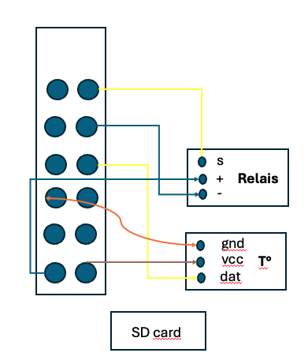

streamit port : 8501
docker build -t aqua2000 . 
docker run -p 8501:8501 aqua2000

Hardware (raspebby) :
ip raspberry : 192.168.1.20
login : alex
pass : 

control light : python relais.py
temperature sensor : python temperature.py

/etc/rc.local
add those lines :
sudo python /home/alex/Documents/aqua2000/relais.py &
sleep 10
sudo python /home/alex/Documents/aqua2000/temperature.py &

deployment steps:
docker tag sonpero/aqua2000 sonpero/aqua2000:1.0.0
docker push sonpero/aqua2000:1.0.0
